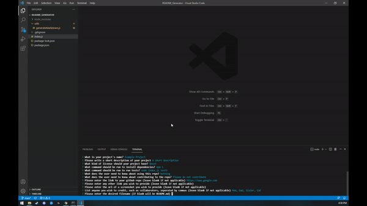

# README_Generator


## Description
Creates a polished readme file for a users Github project, with personalized values captured in the command line

## Table of Contents

- [Links](#links)
- [Example](#example)
- [Installation](#installation)
- [Usage](#usage)
- [License](#license)
- [Contributing](#contributing)
- [Tests](#tests)
- [Questions](#questions)

 ## Links
 Link to video: https://drive.google.com/file/d/1fCaBAgOm__NpLCteZzVifmP0xC23WlNC/view?usp=sharing
 
 Github Rep: https://github.com/davidschepis/README_Generator

 ## Example
 

 ## Installation
To install necessary dependencies, run the following command:

```
npm install
```

 ## Usage
Install dependencies first, limited license options

 ## License
This project is not licensed

 ## Contributing
Please contact me if you wish to contribute

 ## Tests
To run tests, run the following command:

```
node ./index.js
```

 ## Questions
If you have any questions about the repo, open an issue or contact me directly at [davidschepis@gmail.com](mailto:davidschepis@gmail.com).
You can find more of my work at [davidschepis](https://github.com/davidschepis).